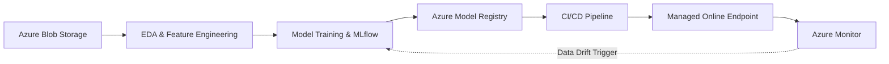

# Credit Card Fraud Detection MLOps System

A cloud-based MLOps platform for automating the training, deployment, and monitoring of a credit card fraud detection model.

## Project Overview

This project builds an automated Machine Learning Operations (MLOps) pipeline for a digital bank to detect fraudulent transactions. The system handles highly imbalanced historical transaction data, automates the training process, registers the best-performing model, and deploys it as a REST API. It also includes continuous monitoring to detect data drift and ensure model reliability in a production environment.

### Project Title

Xây dựng Hệ thống MLOps Phát hiện Gian lận Tín dụng trên Nền tảng Azure

Building a Credit Card Fraud Detection MLOps System on Microsoft Azure

## Main Objectives

- Xây dựng hạ tầng Azure Machine Learning Workspace thông qua mã nguồn (Python SDK/CLI).  
- Phân tích và xử lý tập dữ liệu giao dịch mất cân bằng (Imbalanced data).
- Thử nghiệm và theo dõi các tham số mô hình (Random Forest, LightGBM) bằng MLflow.
- Đăng ký và quản lý phiên bản mô hình tốt nhất vào Azure Model Registry.
- Thiết lập CI/CD Pipeline để tự động triển khai mô hình lên Azure Managed Online Endpoint.
- Giám sát độ trễ (Latency), lưu lượng (Traffic) và thiết lập kịch bản Data Drift để huấn luyện lại (Retraining).

## System Architecture

## Technologies

- Python
- Azure Machine Learning & Azure CLI
- MLflow
- Scikit-learn / LightGBM
- GitHub Actions / Azure DevOps
- Azure Blob Storage & Azure Monitor

## Course Information

- **Course:** Cloud Computing
- **Course Code:** IS402
- **University:** University of Information Technology – VNU-HCM
- **Instructor:** ThS. Hà Lê Hoài Trung
- **Email:** [trunghlh@uit.edu.vn](mailto:trunghlh@uit.edu.vn)

## Team Members

| No. | Full Name | Student ID | Email |
|---:|---|---:|---|
| 1 | Bùi Phạm Bích Phương | 23521239 | [23521239@gm.uit.edu.vn](mailto:23521239@gm.uit.edu.vn) |
| 2 | Nguyễn Thị Thanh Mai | 23520910 | [23520910@gm.uit.edu.vn](mailto:23520910@gm.uit.edu.vn) |
